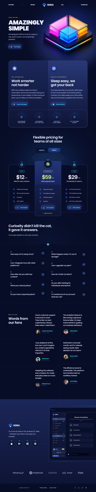

# XORA Saas Platform Landing Page

A modern, responsive landing page concept for XORA — a SaaS platform designed with sleek UI/UX principles using React.js and Tailwind CSS.

## 📖 Overview

XORA’s landing page delivers a professional and polished user interface, featuring smooth animations, interactive elements, and responsive layouts. It serves as an ideal base for SaaS product websites aiming for a clean, modern look.

## ⚙️ Tech Stack

- Vite
- React.js
- Tailwind CSS

## 🔋 Features

- Beautiful Sections including hero, features, pricing, faq, download, testimonial, footer, and header.

- Utilizes tailwindcss for intricate shapes like circular feature displays, grid lines, and side lines.

- Latest UI Trends & Incorporates modern design elements.

- Enhances visuals with stylish gradients using Tailwind CSS for cards, buttons, etc.

- Utilizes gradients, layered cards, bento-inspired layouts, and interactive hover states.

- Fully Responsive & Optimized for seamless browsing across desktops, tablets, and smartphones.

and many more, including code architecture and reusability

## 📄 License
> This project is licensed under the MIT License.
